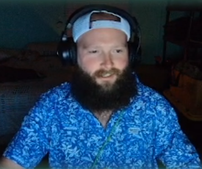

## Kelin Ray



### Bio

```markdown
Hi there! My name is Kelin and I am a web developer. I also have a certificate from a Python based bootcamp. In my spare time, I like to stream games on Twitch and YouTube. I've also been experimenting with AI to create content for my websites and social media channels. If you need help creating content, please let me know and I'll be happy to offer you a free example. Thanks!
```
### Skills

- Studied HTML, CSS, JavaScript, Python at [PDX Code Guild](https://pdxcodeguild.com/)
- Also studied Django, CSS Libraries(Bootstrap/Materialize/etc.), Pip Packages

### Projects
1. Video App
2. Article API
3. StreamTaco

### Work History

1. Content Creator - [The Gear Bunker](https://www.thegearbunker.com/author/kelin-ray/)
2. Streamer - [The Real Militia](http://therealmilitia.com/)
3. AI Create - [AI Create](aicreatedblog.blogspot.com)

### Contact

- Email <kelinray@outlook.com>
- [LinkedIn](https://www.linkedin.com/in/kelin-ray-601469248/)
